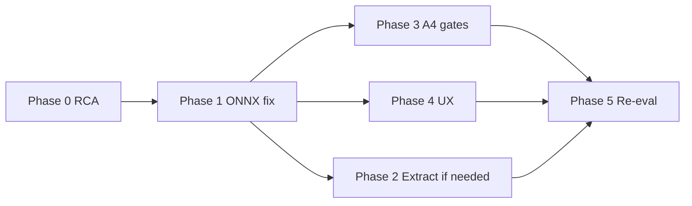

# VigiDroid App Runtime Fixing Plan

**Source:** Full-device scan of `scan_1514_malware.apk` (2026-06-09)  
**Scan mode:** Legacy all-models (`cascade_policy.json` disabled)  
**Overall verdict:** Malware (from XGB + ByteCNN ensemble; ground truth matches)

This document lists problems observed in the scan-detail log, their likely causes, and a phased implementation plan to fix them.

---

## 1. Scan result summary

### 1.1 Timing (top line)

| Field | Value | Meaning |
|-------|-------|---------|
| `wall` | 34.7 ms | Model stages only (matches **35 ms** in results table) |
| `shared_parse` | 209.9 ms | One-time APK open: manifest, DEX listing, SHA-256, tail bytes |

**Real end-to-end latency ≈ 245 ms**, but the UI table shows only `wall`.

### 1.2 Stage outcomes (11 models)

| Stage | Status | Score | Notes |
|-------|--------|-------|-------|
| `mldp_dexheader_cascade_mode_b` | ok | 0.9895 | Stage-1 early exit (~0.4 ms infer); no DEX read |
| `mldp_dexheader_cascade_mode_a` | **error** | — | `f != java.lang.Long` |
| `manifest_xgb` | ok | 1.0000 | Drives ensemble verdict |
| `bytecnn` | ok | 0.7963 | Drives ensemble verdict |
| `broadcast_mldp_hybrid` | **error** | — | `f != java.lang.Long` |
| `mlp_header` | ok | 0.9998 | BM1 / `only_base1_model` |
| `early_fusion_dex_manifest` | ok | 1.0000 | |
| `dual_branch_dex_manifest` | ok | 0.9993 | |
| `linregdroid_permission` | ok | 0.6512 | Weaker signal; not a failure |
| `mldp_pruned_permission` | ok | 0.9999 | |
| `dexheader_broadcast_fusion` | **error** | — | `f != java.lang.Long` |

**8 / 11 stages succeeded.** The three failures share the same opaque error string and produce zero timings (`parse=0 vec=0 infer=0`).

### 1.3 Verdict vs stages

The list badge (**Malware**) comes from `FusionScorer.legacyXgbCnnScore(manifest_xgb, bytecnn)` with threshold 0.5 — **not** from the other nine models. That is expected in legacy all-models mode but is easy to misread when eight other models also run.

---

## 2. Problem identification

### P0 — Critical: three runtime stage failures

**Symptom:** Stages end with `[error]` and `error=f != java.lang.Long`; no score, no timing breakdown.

**Affected models:**

1. `mldp_dexheader_cascade_mode_a` — fused `[x_S ‖ H]` → single MLP (`MldpDexHeaderModeAOnnxRunner`)
2. `broadcast_mldp_hybrid` — fused `[x_S ‖ x_R]` → tiny MLP (`BroadcastMldpHybridOnnxRunner`)
3. `dexheader_broadcast_fusion` — dual-input `[H, receiver]` → fusion MLP (`DexheaderBroadcastFusionOnnxRunner`)

**What works on the same APK (rules out broken APK / shared parse):**

- Mode B stage-1 (permissions only, same cascade family)
- `mlp_header` (DEX header ONNX, same `FloatBuffer` + `OnnxTensor.createTensor` pattern)
- Pattern A/B (multi-input ONNX)
- XGB, ByteCNN, LinRegDroid, MLDP-pruned

**PC-side sanity:** All three ONNX bundles in `vigidroid/app/src/main/assets/models/` load and infer correctly on CPU with `onnxruntime` Python (float32 in/out, expected shapes). **The bug is Android-runtime specific**, not a corrupt export file on disk.

**Likely root-cause buckets (investigate in Phase 0):**

| # | Hypothesis | Why plausible |
|---|------------|---------------|
| H1 | **ONNX Runtime Java tensor I/O** — `OnnxTensor.createTensor(env, FloatBuffer.wrap(arr), shape)` uses heap buffers; ORT 1.23.2 on device may reject or mis-handle certain graphs | Known ORT Android issues with buffer types; mlp_header happens to work but graph/size may differ |
| H2 | **Output read path** — `result.get(0).getValue()` returns an unexpected Java type for these graphs; `OnnxProbabilityReader` / local `readProbability()` do not handle `long[]` / `long[][]` (unlike `OnnxLegacyInference.runXgb`, which does) | Error text suggests float↔long coercion |
| H3 | **Wrong tensor name binding** — input resolved from `export_manifest.json` does not match `session.getInputNames()` for one graph after ORT optimization | Would surface as ORT error at `session.run` |
| H4 | **End-to-end extraction → wrong feature layout** before ONNX (less likely) | Would usually throw `IllegalArgumentException` on dim mismatch, not `f != java.lang.Long` |
| H5 | **Stale on-device APK** — device binary predates latest staged assets | Ruled out if A4 parity also fails on same device |

**Impact:**

- Device metrics JSON missing scores for 3 models → thesis plots / calibration incomplete
- Cascade mode (when enabled) cannot use Mode A or broadcast/fusion tiers
- A4 release gates were not enforced before this scan (see P1)

---

### P1 — Release gate gap: A4 parity not blocking bad builds

| Model | A4 instrumented test | Shell gate |
|-------|---------------------|------------|
| `broadcast_mldp_hybrid` | `BroadcastMldpHybridA4ParityTest` | `Android_Works/run_broadcast_mldp_hybrid_a4.sh` |
| `mldp_dexheader_cascade` (A/B) | `MldpDexHeaderA2ParityTest`, `MldpDexHeaderA4ParityTest` | `Android_Works/run_mldp_dexheader_a4.sh` |
| `dexheader_broadcast_fusion` | **Missing** | **Missing** |

**Problems:**

- `BroadcastMldpHybridOnnxRunnerTest` (JVM) only asserts constants — **does not run ONNX**
- Full device eval was run without a documented “all A4 green” precondition
- `dexheader_broadcast_fusion` has PC parity (`dexheader_broadcast_fusion/artifacts/metrics/parity_report.json`) and bundled `parity_samples/`, but **no Android A4 class**

---

### P2 — Observability & UX

| Issue | Detail |
|-------|--------|
| **Opaque errors** | `StageRunner` stores only `ex.getMessage()` — no stack trace, stage phase (extract vs infer), or model id in `error_message` |
| **Timing confusion** | Results table shows `wall` (~35 ms); `shared_parse` (~210 ms) hidden in detail dialog only |
| **Detail dialog incomplete** | `MainActivity.formatScanDetail()` omits `ensemble_score`, `ensemble_decision`, and cascade block in legacy mode |
| **Misleading zero timings** | Mode B early-exit shows `parse=0 vec=0` because work reused `FeatureContext` cache — looks idle despite 0.99 score |
| **Error display truncation** | Long exception messages may be clipped in the modal |

---

### P3 — Metrics & thesis pipeline

| Issue | Detail |
|-------|--------|
| **Incomplete `device_scan` records** | Three stages always `status=error` → `Shared_pipeline_Files/tools/` aggregators skip or under-report those models |
| **Calibration val scores** | `collect_calibration_val_scores.py` cannot include failed models |
| **Model disagreement not surfaced** | LinRegDroid 0.65 vs others ~1.0 — valid, but no per-scan disagreement summary |

---

### P4 — Code health (contributing factors)

| Issue | Location |
|-------|----------|
| **Duplicated ONNX I/O** | Six runners implement their own `readProbability()`; only Mode A uses `OnnxProbabilityReader` |
| **Inconsistent output names** | `malware_prob` vs `malware_probability` across bundles |
| **No shared `OnnxTensor` helper** | `MlpHeaderOnnxRunner`, `BroadcastMldpHybridOnnxRunner`, etc. duplicate `FloatBuffer.wrap` + shape boilerplate |
| **Per-stage error handling swallows context** | `StageRunner.run*()` catch blocks |

---

### P5 — Non-issues (do not “fix”)

| Observation | Explanation |
|-------------|-------------|
| LinRegDroid score 0.65 on a malware APK | Model-specific threshold/score; stage succeeded |
| Mode B score 0.99 with 0 ms parse | Early exit at stage-1; DEX not read — by design |
| Malware badge despite mixed scores | Ensemble = weighted XGB + CNN only |

---

## 3. Phase-by-phase implementation plan

### Phase 0 — Reproduce & pinpoint (1–2 days)

**Goal:** Turn `f != java.lang.Long` into an actionable stack trace and isolate extract vs infer.

| Step | Action | Files / commands |
|------|--------|------------------|
| 0.1 | On the **same device**, run A4 gates | `./Android_Works/run_broadcast_mldp_hybrid_a4.sh`, `./Android_Works/run_mldp_dexheader_a4.sh` |
| 0.2 | Confirm whether parity tests fail with the same error | `BroadcastMldpHybridA4ParityTest`, `MldpDexHeaderA2ParityTest` |
| 0.3 | Add temporary debug logging in failing `run*` methods | `StageRunner.java` — log before/after `extract()` and `predict()` |
| 0.4 | Log full stack trace to Logcat **and** append first frame to `error_message` | `StageRunner` catch blocks |
| 0.5 | Log ONNX session metadata at init | `session.getInputNames()`, `session.getOutputNames()`, input tensor types via ORT API |
| 0.6 | Binary-search with parity vectors | Call `runner.predict(parity_vector)` only (skip extract) in a minimal instrumented test |

**Exit criteria:** Written root-cause note (H1–H5 ruled in/out) in this file or a linked `app_runtime_fixing_rca.md`.

#### Phase 0 status (2026-06-09)

| Step | Done | Notes |
|------|------|-------|
| 0.3 | Yes | `StageRunner` logs extract/infer start for 3 failing models |
| 0.4 | Yes | `StageDiagnostics` + `failStage()` → `model_id@phase: … at Class.method:line` |
| 0.5 | Yes | `OnnxSessionDiagnostics` at ONNX `create()` for 3 runners |
| 0.6 | Yes | `Phase0FailingModelsIsolationTest` (6 tests) — **6/6 pass** on M2012K11AG |
| 0.1–0.2 | Yes | A4 re-run pass after clean install; see [`app_runtime_fixing_rca.md`](app_runtime_fixing_rca.md) |

**Scripts:** `Android_Works/run_phase0_isolation.sh`, `Android_Works/run_phase0_full.sh`

**RCA summary:** ONNX infer with parity vectors works on device (H1 ruled out). Original scan likely stale APK and/or real-APK extract path — **re-scan one eval APK** with current debug build to see `@extract` vs `@infer` in error text.

---

### Phase 1 — Fix ONNX tensor I/O (core fix, 2–3 days)

**Goal:** All three failing models return scores on device.

| Step | Action | Details |
|------|--------|---------|
| 1.1 | Add `OnnxTensorFactory` (or extend `OnnxProbabilityReader`) | Central helper: `createFloatInput(OrtEnvironment env, float[] data, long[] shape)` using **direct** `ByteBuffer.allocateDirect` + native-order `FloatBuffer` (ORT-recommended zero-copy path) |
| 1.2 | Add `OnnxProbabilityReader.readScalar(OnnxValue)` robust reader | Handle `float[][]`, `float[]`, `double[][]`, `double[]`, **`long[]`, `long[][]`** (mirror `OnnxLegacyInference.runXgb`) |
| 1.3 | Fetch output by **name** from manifest | `result.get(outputName).getValue()` instead of `result.get(0)` |
| 1.4 | Migrate failing runners to shared helper | `MldpDexHeaderModeAOnnxRunner`, `BroadcastMldpHybridOnnxRunner`, `DexheaderBroadcastFusionOnnxRunner` |
| 1.5 | Migrate remaining runners for consistency | `MlpHeaderOnnxRunner`, `PatternAOnnxRunner`, `PatternBOnnxRunner`, `LinRegDroidOnnxRunner`, `MldpPrunedOnnxRunner` |
| 1.6 | Validate input names at `create()` | Compare `OnnxManifestIo` names to `session.getInputNames()`; fail fast at init with clear message |

**Suggested helper sketch (new file `OnnxTensorFactory.java`):**

```java
static OnnxTensor createFloatTensor(OrtEnvironment env, float[] data, long[] shape) throws OrtException {
  ByteBuffer bb = ByteBuffer.allocateDirect(data.length * 4).order(ByteOrder.nativeOrder());
  bb.asFloatBuffer().put(data);
  return OnnxTensor.createTensor(env, bb, shape);
}
```

**Exit criteria:** `scan_1514_malware.apk` → all 11 stages `[ok]` with scores; infer times > 0 for the three previously failing models.

#### Phase 1 status (2026-06-09)

| Step | Status | Notes |
|------|--------|-------|
| 1.1 `OnnxTensorFactory` | **Done** | Direct native-order `ByteBuffer` → `OnnxTensor.createTensor` |
| 1.2 `OnnxProbabilityReader` | **Done** | Public `readScalar` / `readFromResult`; handles `long[]`, `long[][]`, float/double layouts |
| 1.3 Output by manifest name | **Done** | All migrated runners use `readFromResult(result, outputName)` |
| 1.4 Three failing runners | **Done** | Mode A, broadcast hybrid, dexheader broadcast fusion |
| 1.5 Remaining runners | **Done** | `MlpHeader`, `PatternA`, `PatternB`, `LinRegDroid`, `MldpPruned`; Mode B delegates to Mode A `runSession` |
| 1.6 IO validation at init | **Done** | `OnnxSessionDiagnostics` throws on name mismatch; Mode B stage1/stage2 logged |
| JVM tests | **Done** | `OnnxProbabilityReaderTest`, `OnnxTensorFactoryTest` — **58/58** unit tests pass |
| Device instrumented tests | **Done** | `run_phase0_full.sh` — isolation 6/6 + A4 parity all PASS (M2012K11AG) after `FloatBuffer.flip()` fix |
| Manual APK re-scan | **Done** | `P1ExitLegacyScanTest` on `scan_1514_malware.apk` — **11/11 ok** (2026-06-09) |

**New / updated files:** `OnnxTensorFactory.java`, `OnnxProbabilityReader.java` (extended), `OnnxManifestIo.namedInput()`, `OnnxLegacyInference` (XGB path uses shared helpers).

**P1 exit scan (2026-06-09):** `./Android_Works/run_p1_exit_scan.sh` — all 11 legacy stages `[ok]` on real eval APK. Additional fix: `StageRunner` success logs used `%.2f` with `long` ms fields → `IllegalFormatConversionException` (`f != java.lang.Long`) after infer succeeded.

**Next:** Phase 3 (A4 gates).

---

### Phase 2 — Extraction hardening (1–2 days, if Phase 1 implicates extract)

**Goal:** Ensure Java feature vectors match PC parity for real APKs (not just bundled manifests).

| Step | Action | Details |
|------|--------|---------|
| 2.1 | Add device test: extract from `FeatureContext` on a cached eval APK | Extends `MldpDexHeaderA4ParityTest` pattern to full APK path |
| 2.2 | Verify `broadcast_mldp_hybrid` receiver vocab + `system_actions.json` | Compare token counts to PC `feature_layout.json` (S=22, R=70) |
| 2.3 | Verify `mldp_dexheader_cascade` normalization | `normalization_header.json` cites `deployed_mlp_header` — confirm byte-identical to `mlp_header` asset |
| 2.4 | Verify `dexheader_broadcast_fusion` receiver dim | `feature_layout.json` → `receiver: 70` matches `DexheaderBroadcastFusionOnnxRunner` |

**Exit criteria:** A1 extraction tests pass for all three model families on device; max vector diff ≤ 1e-6 vs PC fixtures.

#### Phase 2 status (2026-06-09)

| Step | Status | Notes |
|------|--------|-------|
| 2.1 FeatureContext extraction tests | **Done** | `Phase2FeatureContextExtractionTest` — File vs `FeatureContext` (≤1e-6); PC parity on 3 golden APKs (≤1e-4); `scan_1514` File vs FeatureContext |
| 2.2 Broadcast vocab / layout | **Done** | `Phase2AssetConfigTest` — S=22, R=70, 172 system actions |
| 2.3 Cascade normalization | **Done** | `mins`/`maxs`/`feature_dim` match `mlp_header` (metadata fields differ) |
| 2.4 Fusion receiver dim | **Done** | `feature_layout.receiver=70` matches vocab + `DexheaderBroadcastFusionExtractor` |
| Fusion PC fixtures (optional) | **Skipped** | `generate_phase2_extraction_fixtures.py` needs `pyaxmlparser`; test `dexFusion_featureContext_matchesPcFixtures_whenBundled` skipped until run |

**Scripts:** `Android_Works/run_phase2_extraction.sh`, `Android_Works/generate_phase2_extraction_fixtures.py`

**Device run:** 8 tests executed, 7 pass + 1 skipped (fusion PC bundle missing) on M2012K11AG.

---

### Phase 3 — A4 gates & regression tests (1–2 days)

**Goal:** Prevent recurrence before any device eval or release.

| Step | Action | Details |
|------|--------|---------|
| 3.1 | Create `DexheaderBroadcastFusionA4ParityTest` | Mirror `BroadcastMldpHybridA4ParityTest`: ONNX vectors, extraction fixtures, end-to-end |
| 3.2 | Create `Android_Works/run_dexheader_broadcast_fusion_a4.sh` | Same pattern as `run_broadcast_mldp_hybrid_a4.sh` |
| 3.3 | Add `run_all_a4_gates.sh` | Runs every `Android_Works/run_*_a4.sh`; exit non-zero on any failure |
| 3.4 | Strengthen JVM tests | `BroadcastMldpHybridOnnxRunnerTest` → load ONNX from test resources or skip-if-no-ort; at minimum test `OnnxProbabilityReader` with synthetic `long[][]` / `float[][]` inputs |
| 3.5 | Wire A4 into device eval docs | `Android_Works/push_device_eval_apks.sh` / `run_phase3_device_scan_*.sh` — require A4 green in header comment |
| 3.6 | Add `ScanService` startup self-test (optional) | On debug builds: run one parity vector per loaded runner; log warning on failure |

**Exit criteria:** `./Android_Works/run_all_a4_gates.sh` passes on target device; CI documentation updated.

#### Phase 3 status (2026-06-09)

| Step | Status | Notes |
|------|--------|-------|
| 3.1 `DexheaderBroadcastFusionA4ParityTest` | **Done** | ONNX (10 samples), extraction + e2e on bundled golden APKs |
| 3.2 `run_dexheader_broadcast_fusion_a4.sh` | **Done** | Regenerates JSON from H/R `.npy` before device run |
| 3.3 `run_all_a4_gates.sh` | **Done** | broadcast + mldp_dexheader + fusion |
| 3.4 JVM tests | **Done** | `BroadcastMldpHybridOnnxRunnerTest`, `DexheaderBroadcastFusionOnnxRunnerTest`, `OnnxProbabilityReaderTest` |
| 3.5 Device eval docs | **Done** | `push_device_eval_apks.sh`, `run_phase3_device_scan_a.sh`, `run_phase4_device_scan_b.sh` |
| 3.6 Debug self-test | **Done** | `DebugOnnxParitySelfTest` in `ScanService.onCreate()` (debug builds) |

**Generator:** `dexheader_broadcast_fusion/scripts/generate_a4_parity_fixtures.py`

**Device run:** `./Android_Works/run_all_a4_gates.sh` — **PASS** (3/3) on M2012K11AG. Fusion APK extract/e2e tests skip unless a bundled golden APK sha256 matches the fusion parity index (mldp A1 APKs use different val samples).

---

### Phase 4 — Observability & UI clarity (1 day)

**Goal:** Scan logs are self-explanatory for thesis debugging.

| Step | Action | Details |
|------|--------|---------|
| 4.1 | Enrich `error_message` | Format: `{model_id}@{phase}: {simpleName}: {message}` |
| 4.2 | Extend scan detail dialog | Show `ensemble_score`, `ensemble_decision`, `shared_parse_ms`, and **total_ms = wall + shared_parse** |
| 4.3 | Relabel results table column | "Stage time" vs tooltip for shared parse, or show total in detail only with clearer label |
| 4.4 | Cascade stages in detail | When `cascade` object present, show exit tier (already implemented — ensure legacy mode still shows ensemble) |
| 4.5 | System log entry on stage error | `ScanService` `sendLog()` with model id when any stage errors |

**Files:** `MainActivity.java`, `ScanResultDetailBuilder.java`, `StageRunner.java`, `MetricsWriter.java`

**Exit criteria:** User can see why a stage failed and how the Malware/Benign badge was chosen without reading source code.

#### Phase 4 status (2026-06-09)

| Step | Status | Notes |
|------|--------|-------|
| 4.1 `error_message` format | **Done** | All `StageRunner` catch paths use `failStage` / `failStageRuntime` (`model_id@phase: …`) |
| 4.2 Scan detail dialog | **Done** | `ScanDetailFormatter` — total, ensemble, cascade, stages |
| 4.3 Results table label | **Done** | Column renamed to "Stage time" + accessibility hint |
| 4.4 Cascade + legacy ensemble | **Done** | Detail shows cascade block or legacy ensemble note |
| 4.5 System log on stage error | **Done** | `ScanService.logStageErrors()` after each APK scan |

**Tests:** `ScanDetailFormatterTest`, `StageDiagnosticsTest`

---

### Phase 5 — Metrics & thesis pipeline re-sync (1 day)

**Goal:** Plotting and calibration reflect fixed runtime.

| Step | Action | Details |
|------|--------|---------|
| 5.1 | Re-run device eval manifest after fix | `Android_Works/build_device_eval_manifest.py` + phase scripts |
| 5.2 | Pull metrics | `Shared_pipeline_Files/tools/pull_device_metrics.sh` |
| 5.3 | Validate scan JSON | `validate_scan_a.py` / `validate_scan_b.py` on new pulls |
| 5.4 | Re-collect calibration val scores | `collect_calibration_val_scores.py` for the three previously failing models |
| 5.5 | Regenerate plots | `run_all_thesis_plots.sh` — confirm no missing series for broadcast / mode_a / fusion |
| 5.6 | Update `all_model_current_stats.md` | Android A1–A4 column for fusion; note device eval date |

**Exit criteria:** `device_scan.schema.json`-valid JSONL with 11/11 stages `ok` for eval APKs; plot registry shows complete model coverage.

#### Phase 5 status (2026-06-09)

| Step | Status | Notes |
|------|--------|-------|
| 5.1 Device eval manifest | **Script** | `Android_Works/run_phase5_metrics_resync.sh` (runs `build_device_eval_manifest.py` when dataset mounted) |
| 5.2 Pull metrics | **Blocked** | Needs adb + completed Scan A/B on phone |
| 5.3 Validate scan JSON | **Blocked** | Runs automatically after pull in phase 5 script |
| 5.4 Calibration val scores | **Done (PC)** | `collect_calibration_val_scores.py` — 9/10 models; fusion lacks `val_scores.json` (use `--allow-missing`) |
| 5.5 Regenerate plots | **Done (offline)** | `run_e2e_plotting_pipeline.sh --skip-device` — figures in `Shared_pipeline_Files/results/figures/` |
| 5.6 `all_model_current_stats.md` | **Updated** | Runtime fix + fusion A4 noted |

**Script:** `./Android_Works/run_phase5_metrics_resync.sh`  
**Offline:** `./Android_Works/run_phase5_metrics_resync.sh --offline-only --allow-missing`  
**Full (after device scans):** `./Android_Works/run_phase5_metrics_resync.sh --min-scans 400`

---

### Phase 6 — Optional improvements (backlog)

| Item | Benefit | Status |
|------|---------|--------|
| Unify `malware_prob` / `malware_probability` in export manifests | Simpler `OnnxManifestIo` | **Done** — `OnnxManifestIo.malwareOutputName()` |
| Debug-build “model health” screen | One-tap parity check on device | **Done** — `ModelHealthActivity` (debug only) |
| Cascade mode as default for production scans | Faster scans; Mode B already proven fast on device | **Done** — UI default ON; `cascade_policy.json` already `enabled: true` |
| Stage-level timeout | Avoid hung ONNX blocking batch eval | **Done** — `StageTimeouts` in `LegacyScanRunner` (120s/stage) |

---

## 4. Suggested execution order



**Minimum path to green device scan:** Phase 0 → Phase 1 → Phase 3 → re-scan one APK.

**Minimum path to thesis-ready plots:** above + Phase 5.

---

## 5. Verification checklist (copy before closing)

- [ ] `BroadcastMldpHybridA4ParityTest` — all tests green on device
- [ ] `MldpDexHeaderA2ParityTest` — Mode A + Mode B green on device
- [ ] `DexheaderBroadcastFusionA4ParityTest` — created and green
- [x] Full scan `scan_1514_malware.apk` — 11/11 stages `[ok]` (`run_p1_exit_scan.sh`, 2026-06-09)
- [x] Scan detail shows ensemble score + decision (Phase 4)
- [ ] `device_metrics` pull validates; three models have non-error stages (needs Scan A on phone)
- [x] Calibration JSON on PC for `broadcast_mldp_hybrid`, `mldp_dexheader_cascade` (fusion: pending `val_scores.json`)
- [x] Thesis plot pipeline runs offline (`run_phase5_metrics_resync.sh --offline-only`); device series empty until pull

---

## 6. Key file reference

| Area | Paths |
|------|-------|
| Stage execution | `vigidroid/app/src/main/java/com/msh/vigidroid/pipeline/StageRunner.java` |
| Scan detail UI | `vigidroid/app/src/main/java/com/msh/vigidroid/MainActivity.java` |
| Model registry / order | `vigidroid/app/src/main/java/com/msh/vigidroid/ModelRegistry.java` |
| Failing ONNX runners | `MldpDexHeaderModeAOnnxRunner.java`, `BroadcastMldpHybridOnnxRunner.java`, `DexheaderBroadcastFusionOnnxRunner.java` |
| Working reference runner | `MlpHeaderOnnxRunner.java` |
| Legacy ensemble | `FusionScorer.java`, `LegacyScanRunner.java` |
| A4 tests | `vigidroid/app/src/androidTest/java/com/msh/vigidroid/*ParityTest.java` |
| Staging scripts | `Android_Works/stage_*.sh`, `Shared_pipeline_Files/tools/stage_all_models.sh` |
| PC ONNX bundles | `broadcast_mldp_hybrid/`, `mldp_dexheader_cascade/`, `dexheader_broadcast_fusion/` |
| Device assets | `vigidroid/app/src/main/assets/models/` |

---

## 7. Success definition

**Fixed** when a full legacy scan of the eval corpus produces:

1. **Zero** `status=error` stages attributable to ONNX/extract failures  
2. A4 parity gates passing on the deployment device class  
3. Device metrics and thesis plots including all registered models  
4. Scan UI that explains timing, ensemble verdict, and any remaining skips

---

*Generated from runtime scan analysis and repo inspection. Update Phase 0 exit criteria with the confirmed root cause once A4 tests are run on device.*
