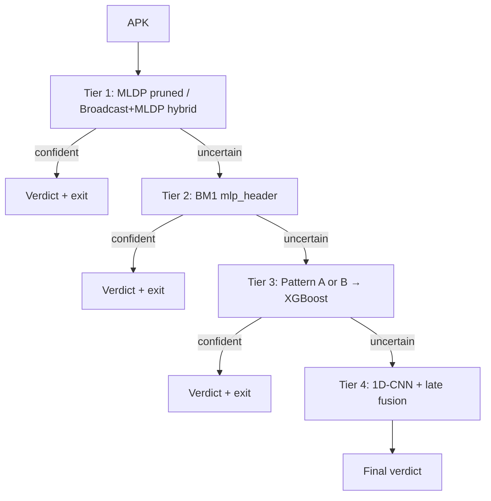

# Vigidroid app metrics and functionality
_Exported on 6/8/2026 at 05:46:18 GMT+6 from Cursor (3.2.16)_

---

**User**

look up the @vigidroid app. and tell me:
1) what metrics are created based on what
2) is the cpu, memory and battery usage logged for the whole scan run? or appwise? or both?
3) is there option to choose which models to run the scan with in the vigidroid app? or is the scan always run with all models?
4) look up @Android_Works and tell me about the sample dataset that is being used to perform scans on my phone poco F3

---

**Cursor**

I'll explore the vigidroid app and Android_Works in the repo to answer your four questions.


Verifying a few key details in the source files for accuracy.


Here is what the repo shows for VigiDroid and the Android_Works device-eval setup.

---

## 1) What metrics are created, and based on what?

Each scanned APK gets **one JSON record** appended to:

`getExternalFilesDir(null)/metrics/all_scan_metrics.json`

Written by `MetricsWriter.java`, shaped by `Shared_pipeline_Files/schemas/device_scan.schema.json`.

### Per-scan record

| Field | Based on |
|-------|----------|
| `scan_id`, `timestamp_ms` | UUID + system time |
| `device` | `Build.MODEL`, `Build.MANUFACTURER`, API level |
| `apk` | Filename, path, size, short SHA-256 of `name:size` |
| `trigger` | `"manual"` (button) or `"download"` (broadcast) |
| `stages[]` | One entry per model that successfully produced a score |
| `ensemble` | Weighted blend of **legacy XGBoost + 1D-CNN only** |
| `totals` | Scan-level wall time, CPU time, memory, DEX stats |

### Per-model stage metrics (`stages[]`)

For each model pipeline:

- `domain` / `model_id` — which model ran
- `parse_ms`, `vectorize_ms`, `inference_ms` — timed with `SystemClock.elapsedRealtimeNanos()`
- `score` — malware probability from that model’s ONNX output
- `mem_delta_bytes` — native heap change around that stage

Up to **8 pipelines** can appear:

| Domain | Model | Features extracted from |
|--------|-------|-------------------------|
| `manifest_xgb` | XGBoost | Manifest permissions/intents + all `classes*.dex` tokens → 2500-d binary vector |
| `bytecnn` | 1D-CNN | Last 1024 bytes of the APK |
| `manifest_mldp_perm_receiver_actions` | Broadcast+MLDP hybrid | MLDP permissions + broadcast receiver actions |
| `dex_header_d3` | BM1 (`mlp_header`) | Summed DEX header bytes (104-d) |
| `dex_header_manifest` | Pattern A | DEX header + manifest bag-of-words |
| `dex_header_manifest_dual` | Pattern B | Same inputs, dual-branch fused ONNX |
| `manifest_permissions` | LinRegDroid | Manifest permission vector |
| `manifest_permissions_mldp` | MLDP pruned | MLDP-selected permission subset |

### Scan-level totals (`totals`)

| Field | Source |
|-------|--------|
| `wall_ms` | Elapsed real time over the timed block |
| `cpu_ms` | `Debug.threadCpuTimeNanos()` for the scan thread |
| `mem_delta_bytes` | `Debug.getNativeHeapAllocatedSize()` before vs after |
| `total_dex_files_found` | Count of `classes*.dex` during XGBoost extraction |
| `structural_parsing_time_ms` | Wall time for XGBoost ZIP/manifest/DEX parsing |
| `battery_pct_delta` | Always `null` (placeholder only) |

### Ensemble (UI verdict)

Only **XGBoost + 1D-CNN** feed the displayed verdict, weighted by fixed validation accuracies (`weighted_validation_accuracy` policy). The thesis models (BM1, Pattern A/B, LinReg, MLDP, Broadcast+MLDP) are logged in `stages[]` but do **not** affect `ensemble`.

---

## 2) CPU, memory, battery — whole scan, per-app, or both?

**Per APK**, not aggregated across a multi-APK batch. Each `.apk` in `/sdcard/Download/` gets its own record when you press **Start APK Scan**.

| Resource | Scan totals (`totals`) | Per-model (`stages[]`) | Battery |
|----------|------------------------|-------------------------|---------|
| **Wall time** | Yes (`wall_ms`) | Yes (`parse_ms`, `vectorize_ms`, `inference_ms`) | — |
| **CPU** | Yes (`cpu_ms`) | **No** per-stage CPU | — |
| **Memory** | Yes (`mem_delta_bytes`) | Yes (`mem_delta_bytes`) | — |
| **Battery** | Placeholder (`null`) | No | **Not implemented** |

### Important caveat on totals

`cpu_ms`, `wall_ms`, and `mem_delta_bytes` in `totals` are captured **before** Pattern A, Pattern B, LinRegDroid, and MLDP pruned run:

```284:299:/run/media/abd-faiyaz/Files/thesis_vigidroid/vigidroid/app/src/main/java/com/msh/vigidroid/ScanService.java
            long cpuEnd = Debug.threadCpuTimeNanos();
            long memEnd = Debug.getNativeHeapAllocatedSize();
            long wallEnd = SystemClock.elapsedRealtimeNanos();
            // ...
            long memDelta = memEnd - memStart;
            long xgbMemDelta = memDelta / 2;
            long cnnMemDelta = memDelta - xgbMemDelta;
```

Pattern A/B, LinReg, and MLDP pruned start at line 325+. So `totals` cover **XGBoost, 1D-CNN, Broadcast+MLDP, and BM1 only** — not the full 8-model run.

### Memory detail

- **XGBoost & 1D-CNN:** total memory delta is **split 50/50** between the two stages (not measured individually).
- **Thesis models (Broadcast+MLDP, BM1, Pattern A/B, LinReg, MLDP):** measured per stage with before/after `getNativeHeapAllocatedSize()`.
- **Battery:** `battery_pct_delta` is hard-coded to `null`; no `BatteryManager` usage exists in the app.

---

## 3) Can you choose which models to run?

**No.** There is no UI toggle, settings screen, or intent extra to pick models. The main screen only has a **Start APK Scan** button.

At startup, `ScanService` tries to load every pipeline; on each APK it runs every successfully loaded model unconditionally. A model is skipped only if its ONNX assets fail to load.

Docs in `patternB_android_steps.md` mention a future *"enable one model at a time (config flag)"* idea, but that is **not implemented** in the app today.

**Practical behavior:** if all assets are bundled and load OK, all 8 pipelines run on every APK.

---

## 4) Android_Works sample dataset for your Poco F3

Your Poco F3 is the **target device** for running VigiDroid — there is **no Poco-specific APK list**. The app scans whatever `.apk` files are in `/sdcard/Download/`.

### The device-eval dataset

Defined in `Android_Works/device_eval_manifest_summary.json` and pushed via `Android_Works/push_device_eval_apks.sh`:

| Property | Value |
|----------|-------|
| **Total APKs** | 400 |
| **Benign** | 300 |
| **Malware** | 100 |
| **Years** | 2022 and 2023 only |
| **Sampling** | Size-stratified across buckets (`<1MB` through `100–200MB`) |
| **Random seed** | 42 |
| **Total size** | ~7.71 GB |

Size breakdown (benign / malware per bucket):

- `<1MB`: 20 / 0  
- `1–5MB`: 78 / 8  
- `5–10MB`: 66 / 20  
- `10–20MB`: 65 / 20  
- `20–50MB`: 71 / 14  
- `50–100MB`: 0 / 33  
- `100–200MB`: 0 / 5  

### Source corpus

Sampled from **`thesis_full_dataset`** (~13,528 APKs total, 2020–2023, benign+malware corpus including AndroZoo). On disk, APKs are named by **SHA256 hash**, not human-readable app names.

On the phone they are renamed sequentially, e.g.:
- `eval_0001_benign.apk` … `eval_0400_malware.apk`

Benign and malware are **interleaved** in the push script, not grouped as 300 benign then 100 malware.

### Workflow on Poco F3

```
thesis_full_dataset (13,528 APKs)
        ↓  size-stratified sample, seed=42, 2022–2023
device-eval subset (400 APKs)
        ↓  bash Android_Works/push_device_eval_apks.sh
Poco F3: /sdcard/Download/eval_*.apk
        ↓  VigiDroid scans all .apk in Download/
all_scan_metrics.json  →  pull_device_metrics.sh → PC
```

Steps from `Android_Works/BM1_android_steps.md`:
1. Install VigiDroid on Poco F3 via Android Studio
2. **A4 parity** — 8 embedded samples per model in app assets (separate from the 400-APK set)
3. **A3 real scans** — push eval APKs, tap **Start scan**
4. Pull results with `bash Shared_pipeline_Files/tools/pull_device_metrics.sh`

### What is *not* the scan dataset

| Item | Role |
|------|------|
| **8 parity samples** per model (`parity_samples/index.json`) | Correctness checks only (A4) |
| **Full 13,528-APK corpus** | PC training/preprocessing, not pushed to phone by default |
| **Poco F3 mentions in docs** | Hardware target, not a dataset filter |

**Note:** `device_eval_manifest.csv` is referenced by the push script but is not in the repo; only `device_eval_manifest_summary.json` and the full APK list inside `push_device_eval_apks.sh` are committed. Human-readable app names are not stored — only SHA256 hashes.

---

**User**

tell in short: each apk gets a score from each model right? then how is it decided overall whether it is benign or malware?

---

**Cursor**

Yes — each model outputs its own malware probability in `stages[]` (0 = benign, 1 = malware).

**But the overall verdict does not use all of them.** Only the **legacy XGBoost + 1D-CNN** scores are combined into `ensemble.score`:

```
ensemble = (0.9748 × xgb_score + 0.9608 × cnn_score) / (0.9748 + 0.9608)
```

Then:
- `ensemble >= 0.5` → **malware**
- `ensemble < 0.5` → **benign**

The other models (BM1, Pattern A/B, LinReg, MLDP, etc.) are logged for metrics/research but **do not affect** the final decision shown in the UI or written to `ensemble.decision`.

Example from your metrics file: XGB=0, CNN=0.28 → ensemble=0.14 → **benign**.

---

**User**

but this just kinda makes putting in the other models useless, so what do you suggest about the changes that need to be made here?

---

**Cursor**

Checking project docs and design intent so suggestions fit the thesis pipeline.


You're right that **for the final verdict today**, the extra models are mostly research instrumentation — they populate `stages[]` but don't move `ensemble.decision`. That was a deliberate interim choice: keep the old XGB+CNN verdict stable while wiring new models in.

Your own docs already point at the real fix: **Phase 8 — cascade + adaptive ensemble** (`why_pipeline.md`). Here's what I'd actually change, in priority order.

---

### 1. Split "logging" from "decision" (small refactor, high value)

Right now `ScanService` hardcodes one policy. Instead:

- **`stages[]`** — always log every model score (keep as-is).
- **`ensemble`** — computed by a small `EnsemblePolicy` / `ScanOrchestrator`, driven by an asset file like `assets/ensemble_policy.json`.

That JSON would define:
- which `model_id`s participate
- weights (from validation accuracy or F1 on your held-out set)
- threshold (default 0.5)
- policy name (written to `ensemble.policy`)

Example policies you could ship side by side:

| Policy | Use |
|--------|-----|
| `legacy_xgb_cnn` | Current behavior (backward compatible) |
| `weighted_all` | All loaded models, accuracy-weighted average |
| `majority_vote` | Simple baseline for thesis comparison |
| `cascade_mldp_header` | Thesis Task 2 — see below |

The UI could show **per-model scores** plus **one chosen verdict policy** (or even two policies for A/B comparison).

---

### 2. Don't just average everything blindly — use a cascade

A flat average of 8 models is the easiest fix but weak academically: models see different features, may be poorly calibrated, and expensive ones always run.

A better fit for your thesis is **multistep cascade** (already planned):

```
Cheap/fast models first (MLDP permissions, Broadcast+MLDP, LinReg)
    → if confident → verdict, stop
    → if uncertain → run Dex header / Pattern A/B / XGB / CNN
```

That makes the "other" models **first-class**:
- MLDP/Broadcast become **early gates** (fast, permission-focused)
- BM1/Pattern A/B become **escalation** models
- XGB+CNN become **heavy fallback** or stay in a late fusion step

Log in JSON: `cascade_path`, `models_skipped`, `exit_reason` — great for feasibility plots (Phase 10).

---

### 3. If you want a simple full ensemble first

Before building the full cascade, a quick win:

```java
ensemble = Σ (weight_i × score_i) / Σ weight_i   // only models with score >= 0
decision = ensemble >= threshold ? "malware" : "benign"
```

**But** you need per-model weights from PC validation runs (BM1 ~0.966, etc.) and ideally **probability calibration** so a 0.7 from LinReg means the same as 0.7 from XGB. Without that, weighted average is shaky.

---

### 4. Fix two related bugs while you're there

1. **`totals.cpu_ms` / `wall_ms` / `mem_delta_bytes`** are captured *before* Pattern A/B, LinReg, and MLDP run — so resource metrics undercount the real scan. Move the end timers to after all models.
2. **XGB/CNN memory** is a 50/50 split guess — either measure per-stage or drop per-stage mem for those two and only report scan-level totals.

---

### 5. What I'd *not* do

- **Don't** let every model vote equally in the UI forever without a configurable policy — you lose the ability to compare strategies in the thesis.
- **Don't** delete the per-model `stages[]` logging — that's the valuable part for profiling and Pareto analysis.
- **Don't** block on perfect fusion before shipping — ship `legacy_xgb_cnn` + `weighted_all` as two switchable policies first, then add cascade.

---

### Practical sprint I'd recommend

| Step | Work |
|------|------|
| **S1** | Add `ensemble_policy.json` + `EnsemblePolicy.java`; extend weighted ensemble to all models; keep `legacy_xgb_cnn` as default |
| **S2** | Pull validation accuracies from each model's PC metrics into that JSON |
| **S3** | UI: show all model scores; label which policy produced the verdict |
| **S4** | Implement cascade policy (cheap → expensive, with uncertainty band e.g. 0.35–0.65) |
| **S5** | Fix totals timing + document policies in README |

---

**Bottom line:** the extra models aren't useless — they're **waiting for a fusion layer**. The minimal fix is a configurable weighted ensemble over all models; the **thesis-grade** fix is a cascade where cheap models gate expensive ones. Both can coexist as named policies in the same JSON metrics file.

If you want, I can implement S1 (configurable ensemble + `weighted_all` policy) as a focused change in `ScanService` without touching the cascade yet.

---

**User**

make a file called vigidroid_current_metrics_state.html, there using  tables put these info:
1) what metrics are collected per apk during scan (list whats collected for each model also)
2) what metrics are collected for the full scan
then list all the current limitations of the app (like missing battery percentage collection over full scan, timing related issues etc) point by point ,along with your suggested fix

---

**Cursor**

Gathering current metrics implementation details from the codebase to build an accurate HTML reference.


Creating the HTML reference document with tables for per-APK metrics, full-scan behavior, and limitations.


Fixing a stray list item in the HTML.


Created `vigidroid_current_metrics_state.html` at the repo root. It includes:

**Section 1 — Per APK metrics**
- Table of all top-level JSON fields (`scan_id`, `device`, `apk`, `trigger`, `ensemble`, `totals`)
- Table of shared `stages[]` fields (`parse_ms`, `vectorize_ms`, `inference_ms`, `score`, `mem_delta_bytes`)
- Per-model table for all 8 pipelines (what each timing field covers, score basis, memory measurement quality)

**Section 2 — Full scan (batch) metrics**
- What exists vs what’s missing at batch level (no `session_id`, no batch wall/CPU/battery totals)
- Per-APK `totals` block explained, including the partial-timing caveat

**Section 3 — 14 limitations with suggested fixes**
- Battery not collected
- Totals exclude Pattern A/B, LinReg, MLDP
- No per-stage CPU
- XGB/CNN memory estimated 50/50
- Native heap only
- No batch/session grouping
- Ensemble ignores 6 models
- Inconsistent `model_id`
- No model selection
- Weak `sha256_short`
- Unused schema triggers
- File rewrite scalability
- Silent stage omission on failure
- UI lacks per-model scores

Open it in a browser from: `vigidroid_current_metrics_state.html`

---

**User**

now if cascading of models was implemented, then based on @todo_model_ranks.html and @opus_suggested_models.md , tell me which models would be early gates, which would be escalation models, and which would be the heavy fallback or late fusion models.


---

**Cursor**

Based on `todo_model_ranks.html` (usability rank = cheap/fast first) and `opus_suggested_models.md` (extract cost + explicit cascade notes), a sensible cascade would look like this:

---

## Cascade logic (from your docs)

```
Score < t_low  → confident benign  → STOP
Score > t_high → confident malware → STOP
Otherwise      → escalate to next tier
```

Usability rank and “extract cost” in the opus doc align well: **manifest-only / tiny vectors first**, then **structural (Dex header)**, then **behavioral / BoW / sparse Dex**, then **heavy parsers + byte models**.

---

## Tier 1 — Early gates (run on every APK)

Cheapest models; goal is to clear a large fraction of APKs in one pass.

| Model | Usability rank | Why here | VigiDroid today |
|-------|----------------|----------|-----------------|
| **MLDP-Pruned Permission** | 3 | ~20–40 dims, manifest-only, lowest-dimensional manifest model (opus #2) | ✅ `mldp_pruned_permission` |
| **Broadcast + MLDP Hybrid** | **1** | Best manifest-only balance; ~50–120 dims, no Dex (opus #3) | ✅ `broadcast_mldp_hybrid` |
| **LinRegDroid** | 7 | Fastest inference, tiny linear model (opus #5) — useful as baseline gate, but overlaps XGB manifest signal | ✅ `linregdroid_permission` |
| **Broadcast Receiver + Permission** | 4 | Subset of Broadcast+MLDP; redundant if hybrid is deployed | ❌ (covered by hybrid) |

**Recommended Step 1 order:** MLDP pruned → Broadcast+MLDP hybrid (or fused as one gate). LinRegDroid optional parallel check, not a separate tier.

Opus explicitly designs **MLDP + Dex Header** (rank **2**) as the **“fastest accurate filter”** — either:
- **Mode A:** fused ~150-d vector → one tiny MLP (single early gate), or  
- **Mode B Stage 1:** MLDP logistic only, then escalate to header.

---

## Tier 2 — Escalation (uncertain after Tier 1)

Medium cost; structural or light behavioral signals.

| Model | Usability rank | Why here | VigiDroid today |
|-------|----------------|----------|-----------------|
| **MLDP + Dex Header Cascade** (Mode B Stage 2) | **2** | Opus #11: MLDP first, then **MLP(H)** on 104-d header if uncertain | ⚠️ Split as `mldp_pruned` + `mlp_header` (BM1), not wired as cascade |
| **BM1 / MLP(H)** | — (already impl.) | Dex header only; ZIP + header bytes, no BoW/bytecode (opus context) | ✅ `mlp_header` |
| **Dex Header + Broadcast Receiver Fusion** | 5 | Low extraction, header + receiver actions; opus “fallback if ANASTASIA too heavy” | ❌ not implemented |
| **ANASTASIA-lite** | 6 | Medium extract (manifest + targeted Dex patterns); best single-pass accuracy among new models (opus #4) | ❌ not implemented |

**Recommended Step 2 order:** `mlp_header` (BM1) → optionally Dex Header + Broadcast fusion or ANASTASIA-lite if you add them.

Your `mldp_dexheader_cascade` plan spells this out:

> Stage 1: MLDP logistic → uncertain → Stage 2: MLP(H) → still uncertain → escalate to expensive stack

---

## Tier 3 — Heavy fallback / late fusion (still uncertain)

High extraction cost or large models; run only when Tier 1–2 leave score in the uncertain band.

| Model | Usability rank | Why here | VigiDroid today |
|-------|----------------|----------|-----------------|
| **Pattern A (ASCNN(C))** | — | Header + manifest BoW (~4.5K-d); heavier than header-only | ✅ `pattern_a_combined` |
| **Pattern B (dual-branch)** | — | Same domains as A, two towers; slightly heavier | ✅ `pattern_b_dual_branch` |
| **XGBoost (D1)** | — | Full manifest + all `classes*.dex` token scan → 2500-d; heaviest manifest/structural parse | ✅ `manifest_xgb` |
| **ERBE Permission + Intent MLP** | 8 | ~1K manifest dims; medium F1, overlaps XGB domain | ❌ not implemented |
| **ANASTASIA + Manifest BoW Fusion** | 9 | Behavioral 128-d + BoW; med–high extract, high F1 (opus #9) | ❌ not implemented |
| **FexDroid Category-Pruned Sparse** | 10 | Opus: *“better suited to multistep cascade (run only when cheaper models uncertain)”* | ❌ not implemented |

**Recommended Step 3 order:** Pattern A or B → XGBoost (if you need max manifest/DEX structural signal).

---

## Tier 4 — Last resort / byte-level late fusion

Highest combined cost; opus says reserve for **Step 3+** or offline high-confidence path.

| Model | Usability rank | Why here | VigiDroid today |
|-------|----------------|----------|-----------------|
| **1D-CNN (ByteCNN)** | — | Cheap inference but orthogonal byte signal; opus FexDroid+Tail doc runs bytes in **late dual-branch fusion** | ✅ `bytecnn` |
| **FexDroid + Raw APK Tail Dual-Branch** | **11** | Opus: *“Reserve for multistep Step 3+”* — sparse 3K–5K + 1024 tail bytes | ❌ not implemented |

ByteCNN fits as **final fallback** or as **late fusion with XGB/Pattern scores** (not as Step 1).

---

## Visual cascade (implemented models only)



---

## Late fusion vs cascade exit

Not every heavy model needs its own cascade step. Your docs also allow **late fusion** at the end:

| Role | Models |
|------|--------|
| **Cascade gates** | MLDP, Broadcast+MLDP, BM1 |
| **Late fusion pool** | XGB + CNN (current ensemble), optionally Pattern A/B scores weighted by validation accuracy |

Thesis models in Tier 3–4 contribute to a **final weighted vote** only if the cascade never reached a confident exit — matching `Pipeline_full_concept.html` (“cheap first; expensive only if uncertain”).

---

## Practical mapping to your 8 deployed models

| Tier | Models to use |
|------|----------------|
| **Early gates** | `mldp_pruned_permission`, `broadcast_mldp_hybrid` (+ optionally `linregdroid_permission`) |
| **Escalation** | `mlp_header` (BM1) |
| **Heavy fallback** | `pattern_a_combined`, `pattern_b_dual_branch`, `manifest_xgb` |
| **Late fusion / last resort** | `bytecnn` (+ weighted blend with XGB or all Tier 3 scores) |

**LinRegDroid** is an early-gate candidate by rank, but opus flags high overlap with XGB — use it for ablation, not as a required cascade step.

**Pattern B vs Pattern A:** same tier; pick one as escalation default (B is slightly heavier; A is simpler single tower).

---

## If you implement all 11 suggested models later

| Tier | Models |
|------|--------|
| **Early gates** | #2 MLDP pruned, #3 Broadcast+MLDP, #1 Broadcast+Permission (or skip if #3 present), #5 LinRegDroid |
| **Escalation** | #11 MLDP+Header cascade (Mode B), #8 Header+Broadcast fusion, #4 ANASTASIA-lite |
| **Heavy fallback** | #9 ANASTASIA+BoW, #6 FexDroid-lite, #7 ERBE MLP, Pattern A/B, XGB |
| **Late fusion** | #10 FexDroid+Tail dual-branch, 1D-CNN, optional full weighted ensemble |

That ordering follows usability rank 1→6 as gates/escalation and ranks 9–11 plus already-implemented XGB/Pattern/ByteCNN as the expensive tail — exactly what `opus_suggested_models.md` and the MLDP+Header cascade docs describe.

---

**User**

okay update @vigidroid_current_metrics_state.html with these info on cascading of models, also put this flowchart in the html

---

**Cursor**

Adding a cascading section with tier tables and the Mermaid flowchart, and renumbering the limitations section.


Updated `vigidroid_current_metrics_state.html` with a new **Section 3 — Planned model cascade (thesis Task 2)**. It includes:

- **3a** — Cascade exit rule table (`t_low` / `t_high` / uncertain band)
- **3b** — Full tier assignment table for all 11 suggested models (Tiers 1–4) with usability ranks and VigiDroid deployment status
- **3c** — Deployed-models-only recommended cascade order (`model_id` + domain)
- **3d** — Mermaid flowchart (Tier 1 → Tier 4 with early exits)
- **3e** — Cascade vs late fusion vs Mode A fused gate
- Note on future metrics fields (`cascade_path`, `models_skipped`, etc.)

Also:
- TOC updated; limitations renumbered to **Section 4**
- Mermaid.js added (dark theme, same as `how_vigidroid_works.html`)
- Tier color accents on table rows
- Source file links for `todo_model_ranks.html` and `opus_suggested_models.md`

Open the file in a browser to render the flowchart.

